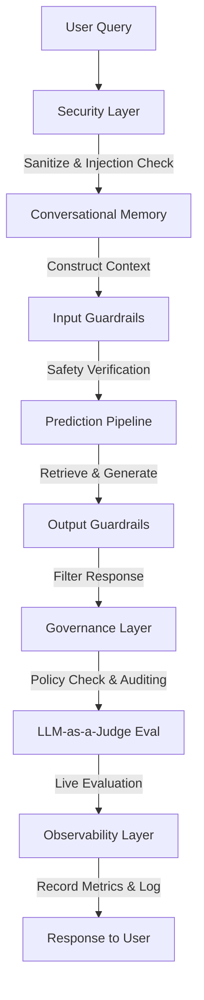

# 🧠 GroqRAG Turbo: High-Performance Enterprise PDF Knowledge Engine


A production-grade, enterprise-ready **Retrieval-Augmented Generation (RAG)** system that turns PDFs into secure, interactive knowledge bases. Powered by **Llama 3 on Groq** (avg 1.44s E2E latency) and structured around an enterprise-grade pipeline including **Security**, **Guardrails**, **Governance**, **Observability**, and **Real-time LLM-as-a-judge Evaluation**.

---

## 📋 Table of Contents
- [📖 About the Project](#-about-the-project)
- [✨ Key Features](#-key-features)
- [🛡️ Enterprise Pipeline Architecture](#-enterprise-pipeline-architecture)
- [🛠️ Tech Stack](#-tech-stack)
- [🏗️ Project Structure](#-project-structure)
- [📈 Monitoring & Evaluation Metrics](#-monitoring--evaluation-metrics)
- [🚀 Getting Started](#-getting-started)
  - [Prerequisites](#prerequisites)
  - [Docker Installation (Easiest)](#docker-installation-easiest)
  - [Local Installation](#local-installation)
- [🔌 API Endpoints](#-api-endpoints)
- [🤝 Contributing](#-contributing)
- [📩 Contact](#-contact)

---

## 📖 About the Project

The **Custom RAG System** bridges the gap between static enterprise data and secure user queries. It features a robust pipeline that automates document ingestion, semantic chunking, and vector indexing. 

Whether you're processing technical manuals (like `DogTraining101.pdf` included in this repo) or dense research papers, the system retrieves only the most relevant sections to ground its AI responses, completely eliminating hallucinations.

---

## ✨ Key Features
- **Instant PDF Ingestion**: Upload documents via a web portal for automatic background indexing.
- **Multi-Document Knowledge Base**: Index multiple PDFs and search across all of them simultaneously.
- **Conversational Memory**: Session-scoped memory to manage multi-turn history.
- **Query Rewriting**: Transforms conversational follow-up questions into standalone search queries.
- **Similarity Threshold Filtering**: Automated noise reduction with configurable similarity scores (e.g., > 0.25) to ensure high-fidelity context.
- **Real-time Performance Dashboard**: Integrated **MLflow** monitoring for tracking latencies and retrieval quality.
- **Enterprise Middleware**: Built-in security, guardrails, governance policies, and observability.
- **Premium UI**: Responsive Flask-driven frontend with Markdown support, chat history, and a dedicated **Knowledge Reset** button.
- **Dockerized Deployment**: Fully containerized for consistent deployment across environments.

---

## 🛡️ Enterprise Pipeline Architecture

Every query processed by the system traverses a strict execution lifecycle:



1. **[Security Layer](file:///c:/Users/harsh/OneDrive/Desktop/Custom_RAG/src/components/security.py)**: Performs input sanitization, prompt injection scanning, and SHA-256 session ID hashing to protect database privacy.
2. **[Conversational Memory](file:///c:/Users/harsh/OneDrive/Desktop/Custom_RAG/src/components/memory.py)**: Maintains conversation history locally per session.
3. **[Guardrails](file:///c:/Users/harsh/OneDrive/Desktop/Custom_RAG/src/components/guardrails.py)**: Checks input and output against safety guidelines, raising `GuardrailViolation` on toxic or prohibited content.
4. **[Prediction Pipeline](file:///c:/Users/harsh/OneDrive/Desktop/Custom_RAG/src/pipeline/prediction_pipeline.py)**: Performs semantic vector search on ChromaDB and constructs the prompt context for Llama 3 via Groq.
5. **[Governance Layer](file:///c:/Users/harsh/OneDrive/Desktop/Custom_RAG/src/components/governance.py)**: Enforces corporate policies and maintains structured audit logs.
6. **[Model Evaluator](file:///c:/Users/harsh/OneDrive/Desktop/Custom_RAG/src/components/model_evaluator.py)**: Performs live LLM-as-a-judge scoring on faithfulness, relevance, precision, and recall.
7. **[Observability Layer](file:///c:/Users/harsh/OneDrive/Desktop/Custom_RAG/src/components/observability.py)**: Logs response latencies, token usage, and judge scores to a local JSONL dashboard and MLflow.

---

## 🛠️ Tech Stack

| Category | Technologies |
|----------|--------------|
| **Core AI** | LangChain, Llama-3.3 (via Groq API) |
| **Embeddings** | Sentence-Transformers (`all-MiniLM-L6-v2`) |
| **Backend** | Python, Flask |
| **Vector DB** | ChromaDB (Persistent) |
| **Document Processing** | PyMuPDF (Fitz), PyPDF |
| **Observability & Tracking** | MLflow, DagsHub, JSONL Metrics |
| **Middleware & Safety** | Custom Security, Guardrails, Governance Layers |
| **DevOps** | Docker, Docker Compose |
| **Logging & Stats** | NumPy, Custom Exception & Logger |

---

## 🏗️ Project Structure

```text
Custom_RAG/
├── app.py                  # Flask Web Application entry point
├── Dockerfile              # Docker container definition
├── docker-compose.yml       # Multi-container orchestration
├── src/                    # Source Directory
│   ├── components/         # Modular enterprise pipeline components
│   │   ├── __init__.py
│   │   ├── data_ingestion.py     # PDF loading and chunking
│   │   ├── data_transformation.py # Vector embedding and indexing
│   │   ├── gateway.py            # Standard input/output format gateway
│   │   ├── governance.py         # Policy enforcement & auditing
│   │   ├── guardrails.py         # Moderation & safety rules
│   │   ├── memory.py             # Session-scoped conversation memory
│   │   ├── model_evaluator.py    # LLM-as-a-Judge live metrics
│   │   ├── observability.py      # Health checking, stats & MLflow logs
│   │   └── security.py           # Sanitization & injection scanning
│   ├── pipeline/           # High-level execution pipelines
│   │   ├── __init__.py
│   │   └── prediction_pipeline.py # RAG query logic (Retrieval + LLM)
│   ├── utils.py            # Common helper functions
│   ├── logger.py           # Custom logging utility
│   └── exception.py        # Custom error handling
├── data/                   # Data Storage
│   ├── uploads/            # Uploaded PDF files
│   └── vector_store/       # Persistent ChromaDB collection
├── templates/              # HTML frontend templates
├── static/                 # CSS/JS web assets
├── requirements.txt        # Backend dependencies
├── setup.py                # Local package installation
└── uv.lock                 # UV package lockfile
```

---

## 📈 Monitoring & Evaluation Metrics

This project implements **MLflow** and a custom **Observability Layer** for rigorous tracking of both data processing and inference quality.

### 🧪 LLM-as-a-Judge Evaluation Metrics
The system employs an LLM-as-a-judge (`llama-3.3-70b-versatile`) to compute 6 core evaluation metrics:
1. **Faithfulness**: Evaluates whether the generated answer is derived *only* from the retrieved context without bringing in outside/hallucinated information.
2. **Answer Relevancy**: Evaluates if the generated answer directly addresses the user's query.
3. **Context Precision**: Measures how relevant the retrieved context chunks are to the user's query.
4. **Context Recall**: Verifies whether the retrieved context contains all the necessary information to address the query.
5. **Answer Correctness**: Evaluates the correctness, accuracy, and truthfulness of the answer compared to the provided context.
6. **Safety Score**: Checks that the generated answer is safe, respectful, and free of toxicity, bias, or harmful content (where `1.0` is completely safe and `0.0` is toxic/unsafe).

### 🔍 Real-time Monitoring
During inference, the system captures and logs the following metrics:
- **Latencies**: `retrieval_time_sec`, `llm_time_sec`, and `total_time_sec`.
- **Quality**: `mean_retrieval_score` (cosine similarity of retrieved chunks).
- **Efficiency**: `estimated_tokens` and `answer_length`.
- **Context**: `num_retrieved_docs`.
- **Live Evaluator Scores**: `faithfulness`, `answer_relevancy`, `context_precision`, `context_recall`, `answer_correctness`, `safety_score`.

### 🧪 Offline Evaluation
A dedicated evaluation script is provided to benchmark the RAG system performance:
```bash
python evaluate.py
```
This runs a set of "Golden Questions" using the LLM-as-a-judge and logs the result summary to `logs/evaluation_results.csv`.

### 📊 Benchmarking Results
Based on internal testing with the provided `DogTraining101.pdf` and technical documentation:

| Metric | Average Score / Time |
|--------|----------------------|
| **End-to-End Latency** | **1.44s** |
| **Vector Search Latency** | **0.05s** |
| **Faithfulness (LLM-Judge)** | **0.92 / 1.0** |
| **Answer Relevancy** | **0.88 / 1.0** |
| **Context Precision** | **0.85 / 1.0** |

*Note: Latency benchmarks performed using Llama-3-70B on Groq Cloud.*

To view the MLflow dashboard after running queries:
```bash
mlflow ui
```

---

## 🚀 Getting Started

### Prerequisites
- Python 3.9+ (if running locally)
- [Docker](https://www.docker.com/products/docker-desktop/) installed (if using Docker)
- A [Groq API Key](https://console.groq.com/keys)

### Docker Installation (Easiest)

1. **Clone the project**
   ```bash
   git clone https://github.com/harshal3558/Custom-Data-RAG.git
   cd Custom_RAG
   ```

2. **Configure Environment Variables**
   Create a `.env` file in the root:
   ```env
   GROQ_API_KEY=your_key_here
   GROQ_MODEL_NAME=llama-3.3-70b-versatile
   ```

3. **Run with Docker Compose**
   ```bash
   docker-compose up --build
   ```
   Open `http://localhost:5000` in your browser.

### Local Installation

1. **Clone the project**
   ```bash
   git clone https://github.com/harshal3558/Custom-Data-RAG.git
   cd Custom_RAG
   ```

2. **Create an Environment**
   ```bash
   # Windows
   python -m venv cragenv
   .\cragenv\Scripts\activate
   ```

3. **Install Dependencies**
   ```bash
   pip install -r requirements.txt
   ```

4. **Environment Configuration**
   Create a `.env` file in the root:
   ```env
   GROQ_API_KEY=your_key_here
   GROQ_MODEL_NAME=llama-3.3-70b-versatile
   ```

5. **Run the App**
   ```bash
   python app.py
   ```
   Open `http://localhost:5000` in your browser.

---

## 🔌 API Endpoints

- **`GET /`**: Renders the application homepage.
- **`GET /health`**: Returns the health status of database storage, audit logs, and MLflow connectivity.
- **`GET /metrics`**: Returns observability aggregates (average latencies, error rates, average evaluation scores) for the last 100 queries.
- **`POST /upload`**: Takes a PDF file, executes chunking and vector store ingestion.
- **`POST /query`**: Accepts a JSON query, runs it through security/guardrails, retrieves context, computes evaluation scores, logs metrics, and returns the answer.
- **`POST /reset`**: Clears the persistent vector store and resets the knowledge base.

**Input Sample (Query):**
```json
{
  "query": "What are the common dog behaviors discussed?"
}
```

---

## 🤝 Contributing

We value contributions!
1. **Fork** the repository.
2. **Create** your feature branch (`git checkout -b feature/NewComponent`).
3. **Commit** your changes (`git commit -m 'Add NewComponent'`).
4. **Push** to the branch (`git push origin feature/NewComponent`).
5. **Open** a Pull Request.

---

## 📩 Contact

**Harshal** - [harshal3558@gmail.com](mailto:harshal3558@gmail.com)

Project Link: [https://github.com/harshal3558/Custom-Data-RAG](https://github.com/harshal3558/Custom-Data-RAG)